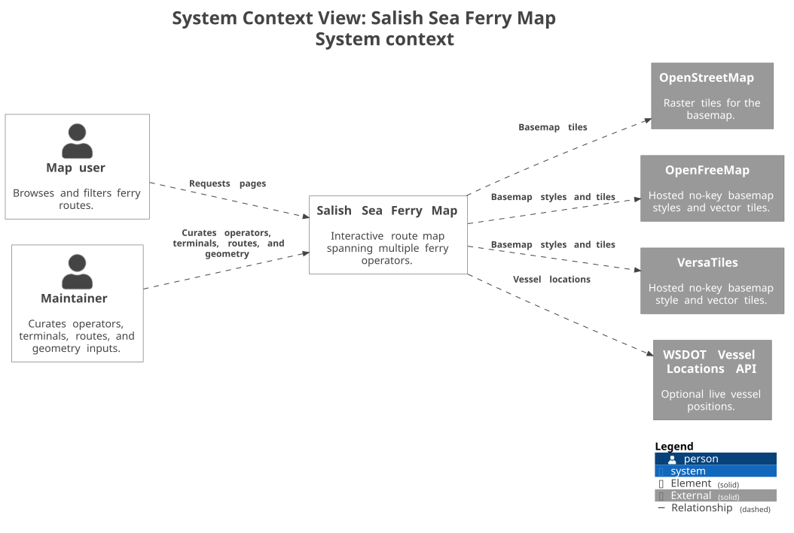
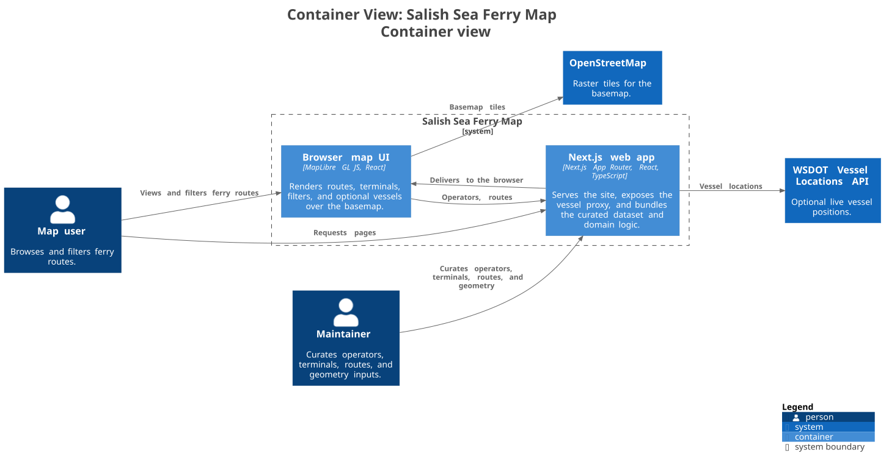
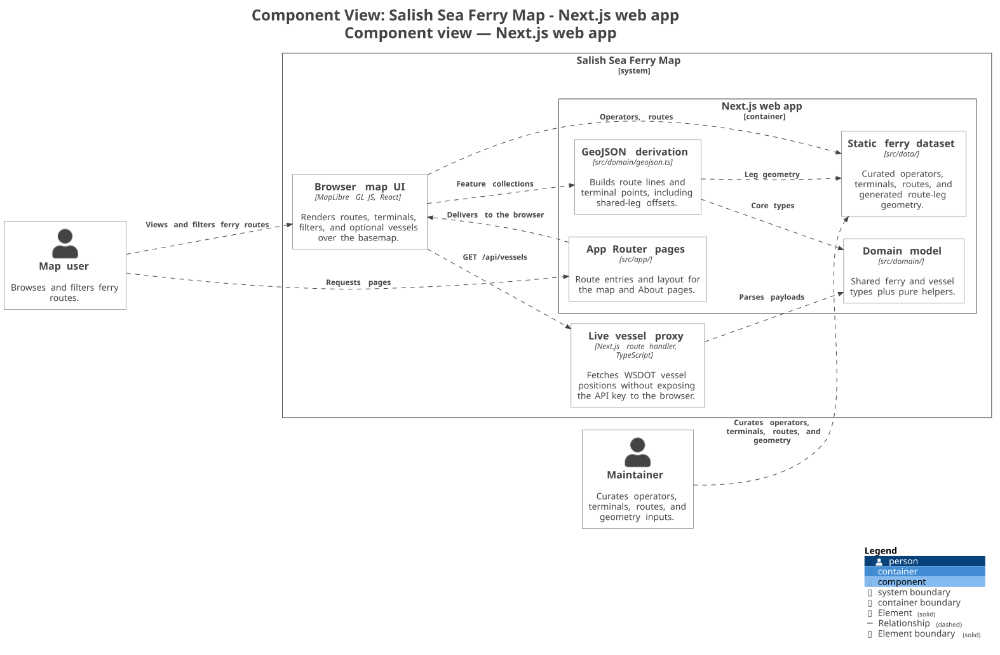
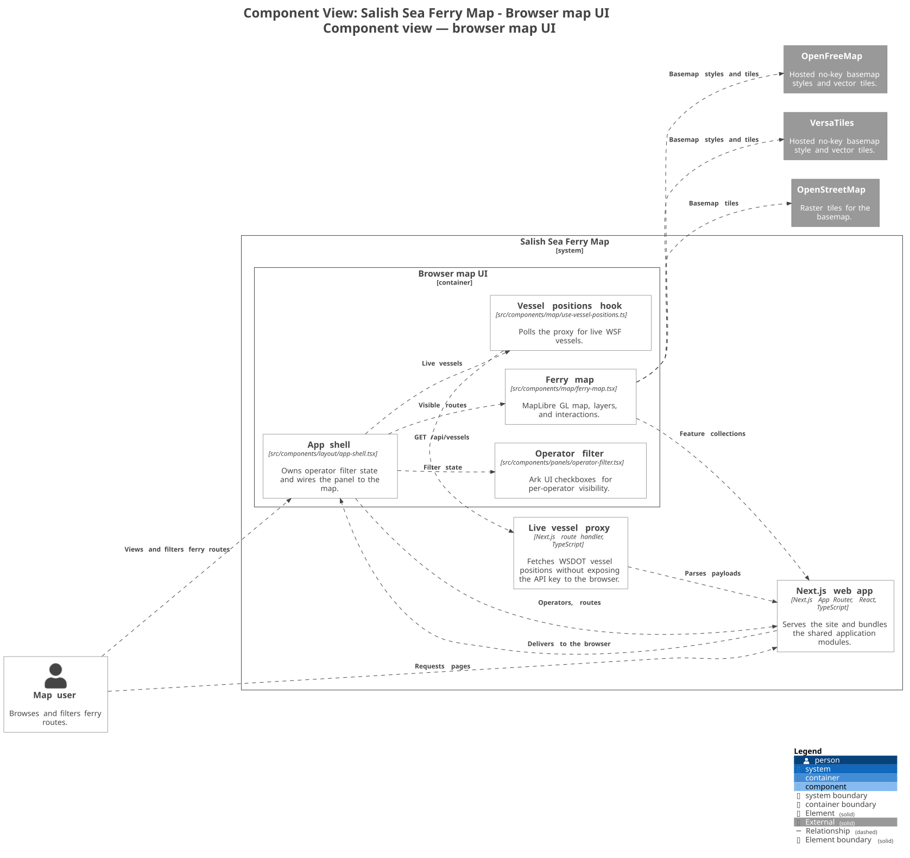
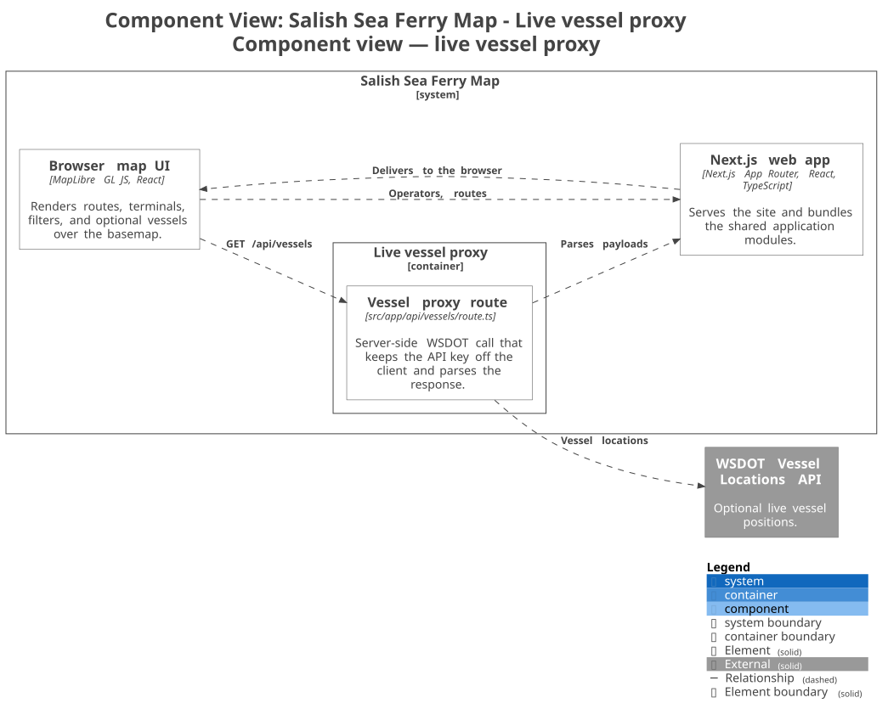

# Architecture overview

This project is a small, static-first map of ferry routes across the Salish Sea.
The core model stays deliberately narrow:

- `Terminal` is a point
- `FerryRoute` is an ordered list of terminal ids sailed by one operator
- map styling, filtering, and GeoJSON are derived from that dataset

That keeps most change in `src/data/` and `src/domain/` instead of spreading
route knowledge across UI code.

## C4 views

Following the [C4 model](https://c4model.com/), zooming in one level at a time.
The source of truth is [`workspace.dsl`](./workspace.dsl); everything below is
generated from it, so the levels cannot disagree with each other.

| Level | View | Scope |
| --- | --- | --- |
| 1 | [System context](./generated/plantuml/structurizr-system-context.svg) | Map user, maintainer, the map itself, and its external dependencies |
| 2 | [Container view](./generated/plantuml/structurizr-container-view.svg) | The Next.js app, the browser map UI, and the live vessel proxy |
| 3 | [Component view — Next.js web app](./generated/plantuml/structurizr-component-view-web-app.svg) | Page entry points plus the shared dataset, domain, and GeoJSON modules |
| 3 | [Component view — browser map UI](./generated/plantuml/structurizr-component-view-browser-map.svg) | The client-side shell, operator filter, map, and live-vessel polling |
| 3 | [Component view — live vessel proxy](./generated/plantuml/structurizr-component-view-vessel-proxy.svg) | The server-side route that fetches WSDOT vessel positions |

### Level 1 — System context



The map, the people who use and maintain it, and the two external systems it
depends on.

### Level 2 — Containers



Three runtime pieces: the Next.js app that serves the site, the browser-side
map UI it delivers, and the live vessel proxy the browser calls for optional
WSF positions.

### Level 3 — Components







Level 4 (code) is deliberately omitted — the type definitions in `src/domain/`
already serve that purpose and would only go stale if duplicated here.

### Where things live, and why

A [C4 container](https://c4model.com/abstractions/container) is "a runtime
boundary around some code that is being executed or some data that is being
stored". Two placements follow from that and are easy to get wrong:

- The **curated dataset** is a component, not a container. It compiles into the
  application bundle and starts nothing.
- The **live vessel proxy** is a container in the runtime view because the
  browser calls a distinct server-side boundary for WSDOT data; at level 3,
  that boundary has a single `Vessel proxy route` component.

The current runtime split is narrower than the directory layout suggests:
`src/domain/geojson.ts` is called from `FerryMap` in the browser, the proxy
parses WSDOT responses server-side, and route-leg geometry is pre-generated at
build time.

`src/domain/mesh.ts` appears in no view at all: it is reached only by
`scripts/build-route-geometry.ts` at build time.

Relationships are declared once in the DSL, at the most specific level that is
true, and Structurizr implies the container- and system-level edges from them.
That is why the container view says the browser map UI requests basemap tiles
and the component view attributes it to the `Ferry map` component — the same
statement, shown at two zoom levels, rather than two claims that can drift apart.

### Regenerating diagrams from the DSL

Edit `workspace.dsl`, then regenerate deliberately — this is not part of
`npm run build` or Netlify deploys. Both tools are pinned, and Docker is used so
that no local Java install is required:

```bash
# from the repository root
rm -rf docs/architecture/generated/plantuml
mkdir -p docs/architecture/generated/plantuml

docker run --rm --user "$(id -u):$(id -g)" -v "$PWD":/work -w /work structurizr/cli:2025.11.09 \
  export -workspace docs/architecture/workspace.dsl \
  -format plantuml/c4plantuml \
  -output docs/architecture/generated/plantuml

docker run --rm --user "$(id -u):$(id -g)" -v "$PWD":/work -w /work plantuml/plantuml:1.2026.8 \
  -tsvg docs/architecture/generated/plantuml/*.puml

perl -0pi -e 's/<\?plantuml [^?]+\?>//g' docs/architecture/generated/plantuml/*.svg
```

The final pass removes PlantUML's processing instruction so the committed SVGs
render inline on GitHub.

Commit the regenerated `.puml` and `.svg` files alongside the DSL change.

## Key runtime pieces

- `src/data/{operators,terminals,routes}.ts` — the hand-curated source of truth
- `src/domain/geojson.ts` — derives map-ready GeoJSON, including shared-leg offsets
- `src/components/map/ferry-map.tsx` — renders the MapLibre map in the browser
- `src/app/api/vessels/route.ts` — optional server-side proxy for WSDOT live vessels

## Data and geometry flow

1. Operators, terminals, and routes are maintained as readonly TypeScript data.
2. Build-time route-leg geometry prefers vendored OSM ferry routes, then mesh
   paths through navigable water, then straight lines as a final fallback.
   This runs in `scripts/build-route-geometry.ts`, which is why `src/domain/mesh.ts`
   appears in no runtime view — it is only reached at build time.
3. The client map consumes the derived GeoJSON and draws routes, terminals, and
   optional live WSF vessels on top of OpenStreetMap tiles.

## Scope boundaries

- This is a **route map, not a trip planner**: schedules and fares stay out of scope.
- This is **not for navigation**: dock-level coordinates and route geometry are
  mapping aids, not charted tracks.

## Notes on the ADRs

The repository history is still shallow, so the ADRs in [`../adr/`](../adr/)
are reconstructed from the README, current source layout, the existing scope
issue for schedules/fares, and the visible git history rather than copied from
older records.
